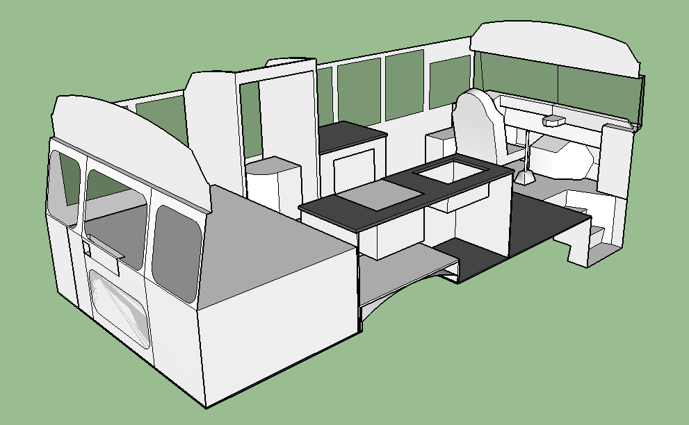

# Steve's Bus

Model of interior of a 1995 International Bluebird DT466 3800.

## Getting Started

To interact with the model you'll need SketchUp. Get it [here](https://www.sketchup.com/plans-and-pricing/sketchup-free).

In order to keep up with the latest version of the model, you can use a git client. You can download GitHub's cleint [here](https://desktop.github.com). Instructions on copying, or cloning, this repository can be found [here](https://help.github.com/en/desktop/contributing-to-projects/cloning-a-repository-from-github-to-github-desktop).

Alternatively, you can simply download the `.skp` file from this repository. You'll have to re-download the file after each update.
